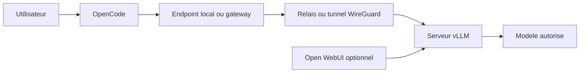
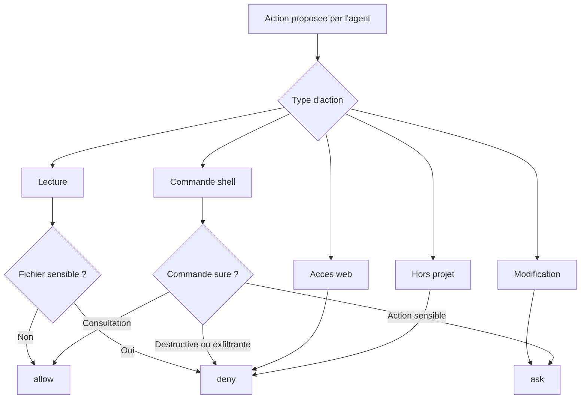
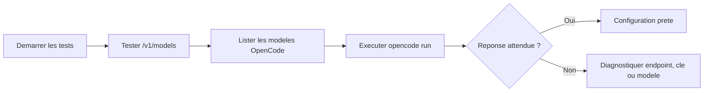

# Configurer OpenCode avec un backend vLLM gouverné

## 1. Résumé Exécutif

Ce guide explique comment configurer OpenCode comme assistant de développement en terminal avec un backend d'inférence vLLM exposé via une API OpenAI-compatible.

L'objectif est de fournir une alternative locale, gouvernée et maîtrisable à un assistant de code externe. L'utilisateur garde une expérience simple côté terminal, tandis que la configuration encadre le modèle utilisé, le chemin réseau, la gestion des secrets et les actions sensibles de l'agent.

Le guide ne dépend d'aucune plateforme interne particulière. Les noms de provider, de modèle, de secret, de service, de namespace, d'adresse IP ou de chemin local doivent être remplacés par des placeholders propres à l'environnement de l'utilisateur.

## 2. Positionnement

Cette solution n'est pas un clone de Claude Code et ne vise pas à reproduire toutes ses fonctionnalités. Elle vise à fournir une base opérationnelle pour utiliser un assistant de développement agentique avec un backend vLLM contrôlé.

Elle privilégie:

- la maîtrise du backend d'inférence;
- la maîtrise du modèle utilisé;
- la non-exposition directe du serveur d'inférence quand un tunnel est utilisé;
- la gestion des secrets hors du fichier de configuration;
- la configuration projet versionnable;
- la validation humaine des actions sensibles;
- la reproductibilité des tests d'accès et d'inférence.

Elle ne fournit pas encore, à elle seule:

- une console d'administration centralisée;
- une politique imposée par MDM;
- une gestion de flotte multi-utilisateur;
- une observabilité consolidée par utilisateur;
- une facturation ou des quotas par équipe;
- une journalisation exhaustive des conversations et actions agentiques.

La solution doit donc être considérée comme une gouvernance au niveau projet et environnement d'exécution, avec une trajectoire possible vers une gouvernance d'entreprise plus centralisée.

## 3. Public Visé

Ce document s'adresse aux utilisateurs finaux autorisés:

- développeurs;
- tech leads;
- personnes chargées de revue ou de documentation technique;
- administrateurs d'un poste développeur;
- utilisateurs internes habilités à utiliser un assistant de code connecté à vLLM.

Le guide ne doit pas contenir de valeurs confidentielles. Les adresses internes, noms de secrets, noms de ressources Kubernetes, IPs privées, tokens et paramètres d'exploitation bas niveau doivent rester dans une documentation d'administration séparée.

## 4. Ce Que L'Utilisateur Doit Obtenir Avant De Commencer

Avant de configurer OpenCode, l'utilisateur doit obtenir les informations suivantes auprès de l'administrateur de l'environnement ou de l'équipe plateforme:

| Élément | Exemple publiable | Description |
| --- | --- | --- |
| Provider OpenCode | `<provider-id>` | Identifiant local du provider à déclarer dans `opencode.jsonc`. |
| Modèle | `<model-id>` | Identifiant du modèle exposé par vLLM. |
| URL OpenAI-compatible | `http://127.0.0.1:18080/v1` ou `https://<gateway>/v1` | URL que OpenCode doit appeler. |
| Variable de clé API | `<LLM_API_KEY_ENV_VAR>` | Nom de la variable d'environnement contenant la clé. |
| Méthode d'injection de clé | script, coffre-fort, shell utilisateur | Manière autorisée de charger la clé sans l'écrire dans Git. |
| Méthode de connexion | direct, tunnel local, VPN, port-forward, gateway | Chemin réseau autorisé vers vLLM. |

### 4.1. Implémentation De Référence Validée

L'implémentation de référence validée pour ce guide utilise les briques suivantes:

| Brique | Rôle | Valeur de référence |
| --- | --- | --- |
| OpenCode | Assistant de développement en terminal | Client local |
| vLLM | Serveur d'inférence OpenAI-compatible | Backend LLM |
| Modèle | LLM exposé par vLLM | `nvidia/NVIDIA-Nemotron-3-Super-120B-A12B-NVFP4` |
| Open WebUI | Interface web optionnelle connectée au même backend | Usage conversationnel et validation fonctionnelle |
| WireGuard | Tunnel réseau optionnel vers un serveur distant | Canal privé chiffré |
| Endpoint local | URL appelée par OpenCode dans l'implémentation de référence | `http://127.0.0.1:18080/v1` |

Open WebUI et WireGuard sont des technologies open source. Leur mention décrit un pattern d'architecture réutilisable, pas une dépendance à une plateforme interne particulière. Un utilisateur peut reprendre le même principe avec un autre endpoint OpenAI-compatible, tant que le modèle, l'URL, la clé API et les permissions OpenCode sont configurés correctement.

Ne pas demander ni partager la valeur brute de la clé API dans un canal non sécurisé.

## 5. Architecture Simplifiée

Deux modes courants sont possibles.

### 5.1. vLLM Local

vLLM tourne sur la machine ou dans un conteneur local.

```text
OpenCode
  -> http://127.0.0.1:<port>/v1
  -> vLLM local
```

### 5.2. vLLM Distant Via Relais Local

vLLM tourne sur un serveur distant. L'utilisateur appelle un endpoint local ou une gateway fournie par l'organisation. WireGuard peut être utilisé pour sécuriser le chemin réseau entre l'environnement local et le serveur d'inférence.

```text
OpenCode
  -> endpoint local 127.0.0.1
  -> tunnel WireGuard ou gateway contrôlée
  -> backend vLLM distant
```



Le guide recommande de privilégier un endpoint local, un tunnel WireGuard ou une gateway contrôlée lorsque le serveur vLLM est distant. Cela évite d'exposer directement le serveur d'inférence au poste utilisateur ou à Internet.

## 6. Installer OpenCode

Pré requis:

- Node.js installé;
- NPM disponible;
- PowerShell ou terminal équivalent;
- accès au projet à configurer.

Installer OpenCode:

```powershell
npm install -g opencode-ai
```

Vérifier l'installation:

```powershell
opencode.cmd --version
```

Sur Windows, utiliser `opencode.cmd`. Le shim `opencode.ps1` peut être bloqué par la politique d'exécution PowerShell.

## 7. Préparer Le Backend vLLM

OpenCode attend une API compatible OpenAI. vLLM peut exposer ce type d'API via son serveur HTTP.

Exemple local, à adapter au modèle et aux contraintes matérielles:

```powershell
$env:OPENCODE_LLM_API_KEY = "<api-key-loaded-from-secure-source>"
vllm serve <model-id> --host 127.0.0.1 --port 8000 --api-key $env:OPENCODE_LLM_API_KEY
```

L'URL OpenAI-compatible devient alors:

```text
http://127.0.0.1:8000/v1
```

Pour un backend distant, l'administrateur doit fournir une URL de gateway ou un mécanisme de tunnel. Exemple générique:

```text
http://127.0.0.1:18080/v1
```

Règles importantes:

- ne pas lancer vLLM sans authentification sur une interface exposée;
- ne pas publier la clé API dans un fichier versionné;
- ne pas exposer le port d'inférence à Internet sans contrôle réseau, TLS et authentification;
- valider que `/v1/models` retourne le modèle attendu.

## 8. Configurer La Clé API

La clé API doit être fournie via une variable d'environnement ou un mécanisme de secret géré.

Exemple PowerShell pour un test local:

```powershell
$env:OPENCODE_LLM_API_KEY = "<api-key-loaded-from-secure-source>"
```

Ne pas écrire la clé dans:

- `opencode.jsonc`;
- un fichier Markdown;
- un script versionné;
- un fichier `.env` commité;
- un message de commit;
- un ticket de support.

La configuration OpenCode doit uniquement référencer la variable:

```jsonc
"apiKey": "{env:OPENCODE_LLM_API_KEY}"
```

## 9. Créer `opencode.jsonc`

Créer un fichier `opencode.jsonc` à la racine du projet.

Configuration de référence:

```jsonc
{
  "$schema": "https://opencode.ai/config.json",

  "enabled_providers": ["<provider-id>"],

  "model": "<provider-id>/<model-id>",
  "small_model": "<provider-id>/<model-id>",

  "share": "disabled",
  "autoupdate": false,

  "provider": {
    "<provider-id>": {
      "npm": "@ai-sdk/openai-compatible",
      "name": "<provider-display-name>",
      "options": {
        "baseURL": "http://127.0.0.1:18080/v1",
        "apiKey": "{env:OPENCODE_LLM_API_KEY}"
      },
      "models": {
        "<model-id>": {
          "name": "<model-display-name>",
          "limit": {
            "context": 131072,
            "output": 16384
          }
        }
      }
    }
  },

  "permission": {
    "*": "ask",

    "read": {
      "*": "allow",
      "*.env": "deny",
      "*.env.*": "deny",
      "**/.env": "deny",
      "**/.env.*": "deny",
      "**/secrets/**": "deny",
      "**/.kube/**": "deny",
      "**/kubeconfig*": "deny"
    },

    "edit": "ask",
    "external_directory": "deny",
    "webfetch": "deny",
    "websearch": "deny",
    "doom_loop": "ask",

    "bash": {
      "*": "ask",

      "git status*": "allow",
      "git diff*": "allow",
      "git log*": "allow",
      "git show*": "allow",
      "grep *": "allow",
      "rg *": "allow",

      "git commit*": "ask",
      "git push*": "deny",

      "kubectl *": "ask",
      "docker *": "ask",

      "npm install*": "ask",
      "pip install*": "ask",

      "curl *": "deny",
      "wget *": "deny",
      "Invoke-WebRequest *": "deny",
      "Invoke-RestMethod *": "deny",

      "rm *": "deny",
      "del *": "deny",
      "Remove-Item *": "deny"
    }
  }
}
```

Remplacer:

- `<provider-id>` par un identifiant court, par exemple `local-vllm` ou `team-vllm`;
- `<model-id>` par l'identifiant exact retourné par `/v1/models`;
- `<provider-display-name>` par un nom lisible;
- `<model-display-name>` par un nom lisible;
- `baseURL` par l'URL OpenAI-compatible réellement fournie;
- `OPENCODE_LLM_API_KEY` par le nom de variable d'environnement autorisé si l'organisation impose un autre nom.

## 10. Comprendre La Politique De Permissions

La configuration `permission` transforme OpenCode en assistant gouverné, pas seulement en client LLM.



Principes:

- lecture du code autorisée par défaut;
- lecture de secrets explicitement bloquée;
- modification de fichiers soumise à validation;
- commandes shell soumises à validation;
- commandes destructives bloquées;
- accès web bloqué par défaut;
- accès hors projet bloqué.

## 11. Lancer OpenCode

Depuis la racine du projet:

```powershell
opencode.cmd
```

Si un script de lancement est fourni par l'organisation, l'utiliser à la place. Le script doit idéalement:

1. charger la clé depuis une source sécurisée;
2. démarrer le tunnel ou vérifier l'endpoint local;
3. tester `/v1/models`;
4. lancer `opencode.cmd`.

Exemple générique:

```powershell
powershell.exe -NoProfile -ExecutionPolicy Bypass -File .\scripts\start-opencode.ps1
```

## 12. Tester La Configuration

### 12.1. Tester Le Backend vLLM

Avec PowerShell:

```powershell
$headers = @{ Authorization = "Bearer $env:OPENCODE_LLM_API_KEY" }
Invoke-RestMethod -Uri "http://127.0.0.1:18080/v1/models" -Headers $headers
```

Adapter l'URL si le backend utilise un autre endpoint.

Résultat attendu:

```text
Le modèle configuré apparaît dans la liste.
```

### 12.2. Tester Le Provider OpenCode

```powershell
opencode.cmd models <provider-id>
```

Résultat attendu:

```text
<provider-id>/<model-id>
```

### 12.3. Tester L'Inférence

```powershell
opencode.cmd run --model "<provider-id>/<model-id>" "Réponds exactement: opencode-ok"
```

Résultat attendu:

```text
opencode-ok
```



## 13. Critères D'Acceptation

L'installation est considérée fonctionnelle et gouvernée si les critères suivants sont vrais.

### 13.1. Poste Local

- `opencode.cmd --version` retourne une version installée.
- `opencode.cmd models <provider-id>` affiche le modèle attendu.
- Le terminal est lancé depuis la racine du projet.

### 13.2. Backend vLLM

- `/v1/models` répond.
- Le modèle configuré est listé.
- L'API exige une clé si elle est exposée hors processus local.
- Le serveur d'inférence n'est pas exposé directement à Internet sans contrôle.

### 13.3. Configuration OpenCode

- `enabled_providers` limite explicitement les providers utilisables.
- `model` et `small_model` sont explicitement configurés.
- `baseURL` pointe vers l'endpoint OpenAI-compatible prévu.
- `apiKey` référence une variable d'environnement.
- Aucune clé API n'est présente dans les fichiers du projet.

### 13.4. Gouvernance Agentique

- `permission` est présent dans `opencode.jsonc`;
- `edit` est configuré en `ask`;
- `bash` contient une règle globale `* = ask`;
- `external_directory` est configuré en `deny`;
- `webfetch` et `websearch` sont configurés en `deny`;
- les commandes destructives sont configurées en `deny`;
- les commandes `kubectl`, `docker`, `npm install` et `pip install` sont au minimum en `ask`;
- les fichiers `.env`, `.env.*`, `.kube`, `secrets` et `kubeconfig` sont explicitement interdits en lecture.

## 14. Matrice De Contrôle

| Domaine | Contrôle attendu | Implémentation attendue | Statut |
| --- | --- | --- | --- |
| Modèle | Modèle explicitement défini | `model = <provider>/<model>` | À vérifier |
| Provider | Provider autorisé uniquement | `enabled_providers = ["<provider>"]` | À vérifier |
| Secret | Pas de clé en clair | Variable d'environnement ou coffre-fort | À vérifier |
| Réseau | Backend non exposé directement si distant | localhost, gateway ou tunnel contrôlé | À vérifier |
| Permissions | Actions sensibles encadrées | `permission` OpenCode | À vérifier |
| Commandes destructives | Blocage explicite | `rm`, `del`, `Remove-Item` en `deny` | À tester |
| Accès web | Désactivé par défaut | `webfetch` et `websearch` en `deny` | À vérifier |
| Accès hors projet | Interdit | `external_directory = deny` | À vérifier |
| Validation | Smoke test disponible | `opencode.cmd run ...` | À vérifier |
| Observabilité | Logs et métriques | Selon environnement | À définir |
| Centralisation | Politique imposée aux postes | Hors périmètre du guide | Limite connue |

## 15. Règles De Sécurité Utilisateur

Ne jamais committer ou partager:

- une clé API;
- un token d'accès;
- une sortie de commande contenant un secret;
- une variable d'environnement de secret avec sa valeur;
- une capture d'écran affichant une clé.

Ne jamais écrire une clé dans:

- `opencode.jsonc`;
- `docs/*.md`;
- `scripts/*.ps1`;
- `.env`;
- un message de commit;
- un ticket ou un outil de support.

Avant de valider une commande proposée par l'agent, vérifier ce qu'elle fait. Redoubler d'attention pour:

- suppressions récursives;
- commandes Git qui modifient l'historique;
- installations de dépendances;
- commandes d'infrastructure;
- modifications de configuration;
- appels réseau externes;
- commandes qui lisent des secrets.

## 16. Bonnes Pratiques D'Usage

- Lancer OpenCode depuis la racine du projet.
- Demander à l'agent d'expliquer son plan avant des modifications importantes.
- Relire les diffs avant d'accepter une modification.
- Lancer les tests adaptés avant de soumettre une PR.
- Éviter de coller des secrets, données personnelles ou données client dans les prompts.
- Garder les changements petits et faciles à relire.
- Ne pas utiliser l'agent pour contourner une politique de sécurité.

## 17. Dépannage

### 17.1. OpenCode N'Apparaît Pas Dans La Recherche Windows

C'est normal. OpenCode est un outil terminal installé via NPM, pas une application graphique Windows.

Utiliser:

```powershell
opencode.cmd
```

### 17.2. PowerShell Bloque `opencode.ps1`

Symptôme:

```text
Impossible de charger le fichier ...\opencode.ps1, car l'exécution de scripts est désactivée
```

Solution:

```powershell
opencode.cmd
```

### 17.3. `/v1/models` Ne Répond Pas

Vérifier:

- que vLLM est démarré;
- que le port local ou la gateway est disponible;
- que `baseURL` pointe vers `/v1`;
- que la clé est chargée dans la variable d'environnement;
- que le firewall ou le tunnel autorise l'accès.

### 17.4. Le Modèle N'Apparaît Pas Dans OpenCode

Vérifier:

- que `<model-id>` correspond exactement à l'identifiant retourné par `/v1/models`;
- que `enabled_providers` contient le bon provider;
- que `model` utilise le format `<provider-id>/<model-id>`;
- que `opencode.cmd models <provider-id>` retourne le modèle attendu.

### 17.5. Le Smoke Test Échoue

Relancer:

```powershell
opencode.cmd run --model "<provider-id>/<model-id>" "Réponds exactement: opencode-ok"
```

Si l'erreur persiste, vérifier dans cet ordre:

1. clé API;
2. URL `baseURL`;
3. disponibilité vLLM;
4. identifiant du modèle;
5. politique de permissions;
6. logs du script ou du serveur.

## 18. Limites Connues

Cette solution fournit une gouvernance au niveau projet et environnement d'exécution, mais ne remplace pas encore une gouvernance d'entreprise centralisée avec politiques administrées, télémétrie d'usage, audit consolidé, gestion de flotte et contrôle organisationnel complet.

Limites à connaître:

- la qualité des réponses dépend du modèle et du contexte fourni;
- l'agent peut proposer une commande erronée ou dangereuse;
- l'utilisateur doit relire les modifications avant de les accepter;
- les politiques de permissions doivent être maintenues par l'organisation;
- les logs, quotas et contrôles d'usage dépendent de l'infrastructure configurée;
- le backend peut être temporairement indisponible;
- la politique projet peut être modifiée par une personne ayant les droits d'écriture sur le dépôt.

## 19. Version Interne Et Version Publiable

Une version interne peut mentionner les identifiants nécessaires à l'usage quotidien.

Une version publiable doit remplacer les valeurs concrètes par des placeholders:

```text
C:\Users\<user>\Desktop\<project>
<provider-id>
<model-id>
<secret-name>
<gateway-service>
<private-ip>
<base-url>
<api-key-env-var>
```

Les valeurs concrètes sont réservées à la documentation interne. La version externe remplace les chemins, secrets, IPs, noms de services et identifiants sensibles par des placeholders.

## 20. Résumé Rapide

Installer OpenCode:

```powershell
npm install -g opencode-ai
```

Configurer `opencode.jsonc` avec:

```text
provider OpenAI-compatible
baseURL vers /v1
apiKey via variable d'environnement
model et small_model explicites
permission explicite
```

Tester le backend:

```powershell
Invoke-RestMethod -Uri "http://127.0.0.1:18080/v1/models" -Headers @{ Authorization = "Bearer $env:OPENCODE_LLM_API_KEY" }
```

Tester OpenCode:

```powershell
opencode.cmd models <provider-id>
opencode.cmd run --model "<provider-id>/<model-id>" "Réponds exactement: opencode-ok"
```

Succès attendu:

```text
opencode-ok
```

Règle principale:

```text
Ne jamais coller, afficher, committer ou partager une clé API ou un secret.
```

## 21. Formulation Courte

Cette solution fournit une alternative locale, gouvernée et maîtrisable à Claude Code en connectant OpenCode à un backend vLLM OpenAI-compatible. L'implémentation de référence utilise le modèle `nvidia/NVIDIA-Nemotron-3-Super-120B-A12B-NVFP4`, avec Open WebUI comme interface web optionnelle et WireGuard comme mécanisme possible de tunnel privé. Elle permet de contrôler le modèle, le chemin réseau, la gestion des secrets et les permissions agentiques au niveau du projet.

Le backend vLLM peut être local ou distant via un relais contrôlé, une gateway ou un tunnel WireGuard. La clé API n'est pas stockée dans la configuration projet. Les actions sensibles de l'agent sont encadrées par une politique de permissions explicite, avec validation humaine pour les modifications, les commandes shell et les actions d'infrastructure.

Cette base est opérationnelle pour un assistant de développement agentique interne, tout en conservant une limite claire: elle n'est pas encore un dispositif d'administration d'entreprise centralisé comparable à une plateforme avec politiques imposées, observabilité consolidée et gestion de flotte.
